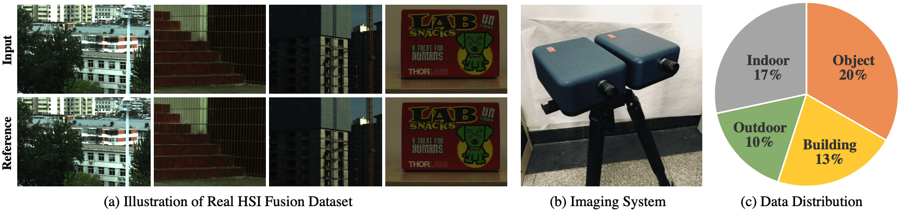

# HSI-RefSR

Hyperspectral Image Super Resolution with Real Unaligned RGB Guidance

[Zeqiang Lai](https://zeqiang-lai.github.io/), [Ying Fu](https://ying-fu.github.io/), [Jun Zhang](https://ysg.ckcest.cn/html/details/3911/index.html)




## News :sparkles:

- 2023-6-6: release all code and full dataset.
- 2022-12-10: release test code and dataset.

## Usage

[Pretrained Model](https://1drv.ms/u/s!AuS3o7sEiuJnmGzI1puJNkC_WGVE?e=MblcI2)
| [Dataset](https://1drv.ms/u/s!AuS3o7sEiuJnmGsd7XtzN9ekPXt6?e=NeAExF)

### Testing

1. Download the test dataset and the pretrained model provided above.
2. Install the dependency via `create_env.sh`, then run the testing commands in `cmd.sh`.

For example, test on our real HSI fusion dataset at the scale factor of 4.

```shell
python run_refsr.py test -s saved/real-sf4 -r best
```

### Training

🏃‍♂️ TBD

## Citation

```bibtex
@article{lai2022hsirefsr,
    title={Hyperspectral Image Super Resolution with Real Unaligned RGB Guidance},
    author={Zeqiang Lai, Ying Fu, Jun Zhang},
    year={2022}
}
```

## Acknowledgement

We specially thank Zheng Fang, Tao Zhang, and Yingkai Zhang for their assistance in the data collection process and the experiments.
